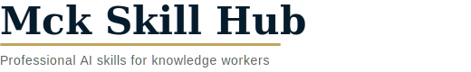

<div align="center">



<br>
<br>

<p>
  <sup>
    <a href="PHILOSOPHY.md">Philosophy</a>&nbsp;&nbsp;&nbsp;
    <a href="CONTRIBUTING.md">Contributing</a>&nbsp;&nbsp;&nbsp;
    <a href="template/skill-template/">Skill Template</a>
  </sup>
</p>

<br>

<p>
  <b>Professional AI skills for knowledge workers who make decks at 2am.</b>
</p>

<p>
  <sub>You don't need to be a consultant to think like one.<br>
  If your job involves slides, strategy, or structured thinking — these skills are for you.</sub>
</p>

<br>

<a href="https://awesome.re"></a>

</div>

<br>

## Why This Exists

Every knowledge worker knows the grind: another deck, another "align the fonts", another "can you make this look more professional?" at midnight. You're smart, you're capable — but 80% of your time goes to formatting, not thinking.

**Mck Skill Hub** collects battle-tested AI agent skills that automate the mechanical parts of knowledge work — so you can focus on the 20% that actually requires your brain.

> *"Does this skill help me work smarter, or just work more?"*

We organize skills around the **Meaning-Achievement Matrix** — a 2×2 that maps every skill to the kind of work-life it helps you build.

## The Framework

```
                        High Achievement
                              ▲
                              │
              ┌───────────────┼───────────────┐
              │               │               │
              │  🐹 HOLLOW    │  🚀 PURPOSEFUL│
              │   VICTORY     │    IMPACT     │
              │               │               │
              │  Run faster,  │  Build what   │
              │  feel less.   │  matters.     │
              │               │               │
   Low ───────┼───────────────┼───────────────┼──── High
   Meaning    │               │               │    Meaning
              │  ⚓ THE DRIFT │  🕯️ QUIET     │
              │               │  CONTENTMENT  │
              │  Lost at sea. │               │
              │               │ Simple riches.│
              │               │               │
              └───────────────┼───────────────┘
                              │
                              ▼
                        Low Achievement
```

## Contents

- [🐹 Hollow Victory](#-hollow-victory) — Automate the grind
- [🚀 Purposeful Impact](#-purposeful-impact) — Coming soon
- [⚓ The Drift](#-the-drift) — Coming soon
- [🕯️ Quiet Contentment](#️-quiet-contentment) — Coming soon

## 🐹 Hollow Victory

*High Achievement × Low Meaning — "Run faster, feel less."*

You're crushing deliverables. The decks are pixel-perfect, the storylines are tight, the stakeholders are impressed. But deep down you know a robot could do 80% of this. These skills **automate the mechanical**, so you can invest time in work that actually needs a human brain.

- [Mck PPT Design](https://github.com/likaku/Mck-ppt-design-skill) - Professional-grade PowerPoint presentations with a full design system: 16+ layouts, typography hierarchy, color tokens, and python-pptx automation. `✅ Production`
- [Professional Speech](https://github.com/likaku/Mck-speech-design-skill) - Structure compelling presentations and talking points using Pyramid Principle, SCQA, and Minto frameworks. `✅ Production`

## 🚀 Purposeful Impact

*High Achievement × High Meaning — "Build what matters."*

The north star. Skills that help you channel your structured-thinking superpowers into work that **matters to you** — side projects, ventures, writing, community building.

> 🔜 Skills coming soon — [Contribute yours!](CONTRIBUTING.md)

## ⚓ The Drift

*Low Achievement × Low Meaning — "Lost at sea."*

Doom-scrolling between meetings. Procrastinating on that deck because nothing feels worth doing. Skills that provide **structure and momentum** when you've lost your compass.

> 🔜 Skills coming soon — [Contribute yours!](CONTRIBUTING.md)

## 🕯️ Quiet Contentment

*Low Achievement × High Meaning — "Simple riches."*

Not everything needs to be a KPI. Skills that support **the life around the work** — reading, reflection, relationships, rest.

> 🔜 Skills coming soon — [Contribute yours!](CONTRIBUTING.md)

## Quality Tiers

| Badge | Tier | Criteria |
|-------|------|----------|
| `✅ Production` | Battle-tested | Used in real projects, refined through iterations |
| `🧪 Beta` | Functional | Core logic works, collecting feedback |
| `🔜 Planned` | Roadmap | Designed but not yet built — PRs welcome! |

## Quick Start

### Install a skill

```bash
# Clone a specific skill repo
git clone https://github.com/likaku/Mck-ppt-design-skill.git

# Copy SKILL.md into your AI agent's skills directory
cp Mck-ppt-design-skill/SKILL.md ~/.claude/skills/

# Or browse the full hub
git clone https://github.com/likaku/mck-skill-hub.git
```

### Use a skill

Each skill repo contains a `SKILL.md` — the machine-readable skill definition with YAML frontmatter and trigger conditions. Copy it into your AI agent's skill directory and it activates automatically.

## Who Is This For?

This isn't just for consultants. It's for every **knowledge worker** who:

- 📊 **Makes decks** — whether for clients, leadership, investors, or internal reviews
- 📝 **Structures arguments** — proposals, strategy docs, business cases, memos
- 🎤 **Presents ideas** — team meetings, all-hands, pitch sessions, board updates
- ⏰ **Works late on formatting** — when the content was done hours ago

If you've ever thought *"I spent 3 hours on fonts and alignment instead of thinking"* — welcome home.

## Contributing

We'd love your skills! See the [Contributing Guide](CONTRIBUTING.md).

**Quick version:**

1. Fork this repo
2. Pick a quadrant — which part of the matrix does your skill serve?
3. Use the [template](template/skill-template/) — start from the standard structure
4. Submit a PR — we review within 48 hours

**Have an idea but no code?** Open an [Issue](../../issues).

## Roadmap

- [x] Core Hollow Victory skills (PPT Design, Professional Speech)
- [ ] More Hollow Victory skills (Charts, Data Models, Email)
- [ ] Purposeful Impact skills launch
- [ ] Community-contributed skills across all quadrants
- [ ] Skill chains — combine skills into workflows

## Philosophy

> *"The knowledge economy produces incredibly capable people who spend 80% of their time on work a machine could do. We built Mck Skill Hub to flip that ratio."*

Read the full [Philosophy →](PHILOSOPHY.md)

## License

[MIT](LICENSE) — Use freely, build boldly, reclaim your evenings.

<br>

<div align="center">
  <sub>Made with ❤️ by knowledge workers who believe your brain deserves better than font alignment.</sub>
</div>
